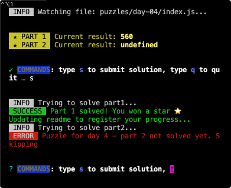

# Z1 Advent of code ⭐️

This is an starting kit for [Advent of code](https://adventofcode.com) (AoC). It's created to provide you with the code structure and functionality so you can focus on designing your solutions for the puzzles.

The following features are included:

- Providing a javascript template for daily solutions
- Allowing you to work on your solutions with dev mode
- Fetching your input automatically
- Submitting your solution from the terminal
- Creating and updating automatically a nice overwiew README with your progress

## How to start

### Install dependencies:

```bash
pnpm install
```

### Add .env file with variables:

```bash
AOC_SESSION_KEY=
YEAR=
```

To get your `AOC_SESSION_KEY`, go to [Advent of code](https://adventofcode.com), open your inspector console and get session cookie from the **_Application_** tab.

> Using `AOC_SESSION_KEY` is optional.
> You can leave this empty and work "manually", by simply copying and pasting input and solutions between your IDE and the AoC web.
>
> But you **will loose access to some features** like fetching input automatically, sending solutions, updating readme automatically with your progress.

### Generate files for your first puzzle

```bash
pnpm start 1
```

The `pnpm start <day>` command creates a folder at the `/puzzles` directory with an starting template to solving your puzzle.

The `/puzzles` directory will be your main working directory, containing all your solutions.

You can customize this template to your liking by editing files at `/templates/js` directory.

### Work on your puzzle

You can run dev mode in one terminal along with tests in other to work on your solution:

```bash
pnpm dev 1
```

```bash
pnpm test
```



### Send your solutions

Once you have a solution for the puzzle, you can check if is correct by running:

```bash
pnpm submit 1
```

If your solution is correct, you will see a message in the terminal and this README will be updated automatically to show your progress ✨.

> This would be available _ONLY_ for users with an `AOC_SESSION_KEY`

## Join the leaderboard

You can [join](https://adventofcode.com/2022/leaderboard/private) Z1's private leaderboard:

```
3197226-79081dfb
```

Also, if you're a Z1 employee, you can register to the AoC internal event for a chance to redeem the stars you won for fantastic Z1 swag and become the ⭐️⭐️ **_Z1 Coder of the year_** ⭐️⭐️.

Join channel `#z1-initiative-advent-of-code`

## Acknowledgements

This template is _heavily_ inspired on a awesome AOC runner from [@caderek](https://github.com/caderek). Check it out [here](https://github.com/caderek/aocrunner).
